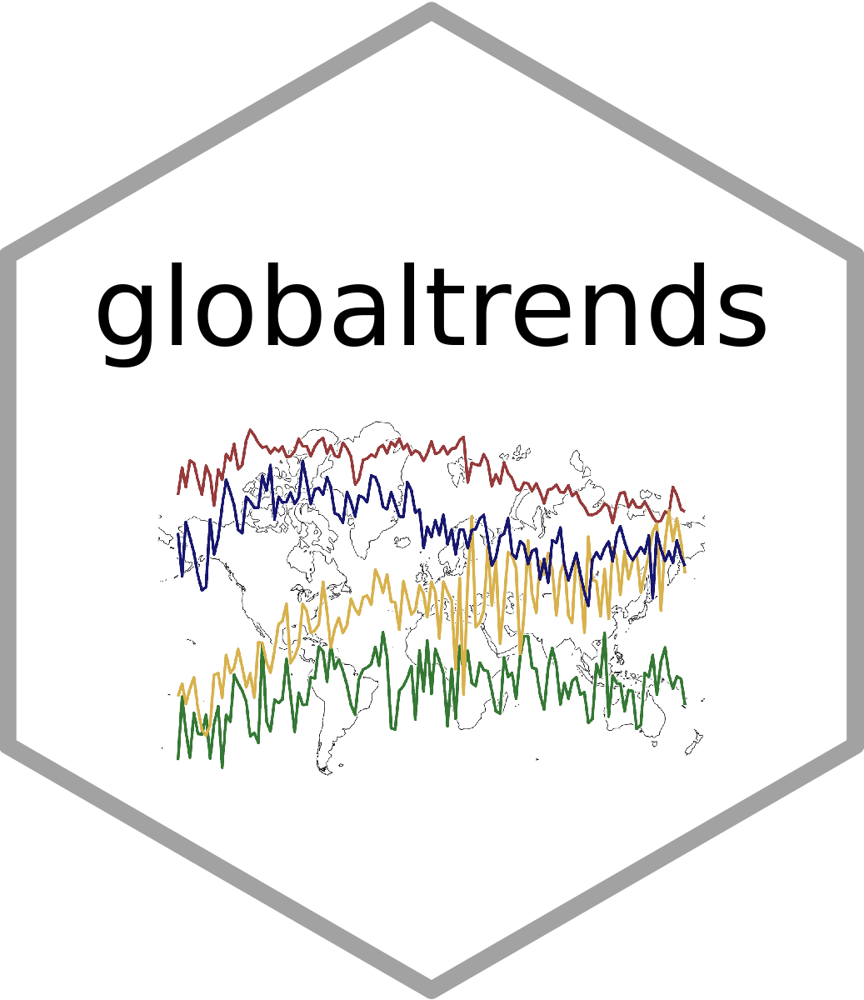

# globaltrends

<!-- -->

Google offers public access to global search volumes through its search engine through the [Google Trends portal](http://www.google.com/trends). The `globaltrends` package downloads search volumes provided by Google Trends and uses them to measure and analyze the **distribution of search trends across countries or within countries**. `globaltrends` allows researchers and analysts to investigate patterns within these trends, such as **degree of internationalization** of firms and organizations or dissemination of political, social, or technological trends across the globe or within single countries.  

To measure degree of internationalization, `globaltrends` offers a wide array of empirical possibilities. It allows researchers to **compare degree of internationalization for various organizations on a unified scale**. In addition, the time-series nature of Google Trends allows for **historical analysis of internationalization patterns and speed** within organizations.  

The enormous detail of the data opens additional applications in research that are impossible with traditional measures of internationalization. For instance, using `globaltrends` on a subnational level allows researchers to **study proliferation within a country** and, for example, to trace a particular market entry. In addition, `globaltrends` offers applications beyond corporate internationalization, such as **data on global interest in products, persons, events, fads or scandals, even academic authors and papers**. 

`globaltrends` provides user-friendly access to Google Trends. For an extensive academic application of the `globaltrends` package, please refer to Venger, Puhr, and Müllner (2020, *Venger_Puhr_Muellner_2020.pdf*). The package vignette (*globaltrends_Vignette.pdf*) offers additonal technical details and a basic tutorial.

````
# install ----------------------------------------------------------------------
devtools::install_github("ha-pu/globaltrends/*release", build_vignettes = TRUE)

# packages ---------------------------------------------------------------------
library(dplyr)
library(globaltrends)

# connect to db ----------------------------------------------------------------
initialize_db()
start_db()

# add new control batch --------------------------------------------------------
new_control <- add_control_keyword(keyword = c("gmail", "map", "translate", "wikipedia", "youtube"))

# add new object batch ---------------------------------------------------------
new_object <- add_object_keyword(keyword = c("manchester united", "real madrid"))

# run control download ---------------------------------------------------------
download_control(control = new_control)
download_control_global(control = new_control)

# run object download ----------------------------------------------------------
download_object(object = new_object)
download_object_global(control = new_control)

# compute search score ---------------------------------------------------------
compute_score(control = new_control, object = new_object)
compute_voi(contorl = new_contorl, object = new_object)

# compute degree of internationalization ---------------------------------------
compute_doi(control = new_control, object = new_object)

# export data ------------------------------------------------------------------
out_score <- export_score(keyword = "manchester united")
out_voi <- export_voi(keyword = "manchester united")
out_doi <- export_doi(type = "obs", locations = "countries")

# plot data --------------------------------------------------------------------
plot_score(data_score = out_score)
plot_voi_ts(data_voi = out_voi)
plot_voi_box(data_voi = out_voi)
plot_doi_ts(data_doi = out_doi)
plot_doi_box(data_doi = out_doi)
plot_voi_doi(data_voi = out_voi, data_doi = out_doi)

# disconnect from db -----------------------------------------------------------
disconnect_db()
````
