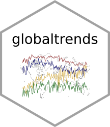

<!-- badges: start -->
[](https://CRAN.R-project.org/package=globaltrends)
[](https://github.com/ha-pu/globaltrends/actions)
[](https://app.codecov.io/gh/ha-pu/globaltrends?branch=master)
<!-- badges: end -->

# globaltrends

<p align="center">
  
</p>

## Introduction

Google offers public access to global search volumes through its search engine
through the [Google Trends portal](https://trends.google.com/trends/). The
`globaltrends` package downloads search volumes provided by Google Trends and
uses them to measure and analyze the **distribution of search trends across**
**countries or within countries**. `globaltrends` allows researchers and
analysts to investigate patterns within these trends, such as **degree of**
**internationalization** of firms and organizations or dissemination of
political, social, or technological trends across the globe or within single
countries.  

To measure degree of internationalization, `globaltrends` offers a wide array of
empirical possibilities. It allows researchers to **compare degree of**
**internationalization for various organizations on a unified scale**. In
addition, the time-series nature of Google Trends allows for **historical**
**analysis of internationalization patterns and speed** within organizations.  

The enormous detail of the data opens additional applications in research that
are impossible with traditional measures of internationalization. For instance,
using `globaltrends` on a subnational level allows researchers to **study**
**proliferation within a country** and, for example, to trace a particular
market entry. In addition, `globaltrends` offers applications beyond corporate
internationalization, such as **data on global interest in products, persons,**
**events, fads or scandals, even academic authors and papers**. 

`globaltrends` provides user-friendly access to Google Trends. The
[package vignette](https://github.com/ha-pu/globaltrends/blob/master/globaltrends_Vignette.pdf)
offers additional technical details and a basic tutorial. Please, refer to the
[package NEWS](https://github.com/ha-pu/globaltrends/blob/master/NEWS.md) for
a change log.

## Usage

**This version of the** `globaltrends` **package uses the Google Trends Research**
**API provided by Google.** To use this version of the package, you must:

1. Apply for API access [online](https://support.google.com/trends/contact/trends_api).
   and generate an API key in your Google developer console.
2. Create a Python or Conda environment where you install the
  `google-api-python-client` package with pip.

To interact with the API (i.e., to download data from Google Trends), you must
first initialize your Python session and run `initialize_python()` before the
downloads (see below). If `initialize_python()` is not called, the downloads
will be made throught the `gtrendsR` package. **We suggest using the official**
**Google Trends Research API as the preferred option to access data from**
**Google Trends!**

````
# install ----------------------------------------------------------------------
# The API-based version of `globaltrends` is not available on CRAN!
# Install the current dev version directly from GitHub:
devtools::install_github(
  repo = "ha-pu/globaltrends",
  ref = "Google-Trends-API",
  build_vignettes = TRUE
)

# packages ---------------------------------------------------------------------
library(dplyr)
library(globaltrends)

# connect to db ----------------------------------------------------------------
initialize_db()
start_db()

# add new control batch --------------------------------------------------------
new_control <- add_control_keyword(keyword = c("gmail", "map", "translate", "wikipedia", "youtube"))

# add new object batch ---------------------------------------------------------
new_object <- add_object_keyword(keyword = c("manchester united", "real madrid"))

# initialize python ------------------------------------------------------------
initialize_python(
  api_key = Sys.getenv("GOOGLE_API_KEY"), # Google Trends API key
  conda_env = Sys.getenv("CONDA_ENV"), # Location of conda environment OR
  python_env = Sys.getenv("PYTHON_ENV") # Location of Python environment
)

# run control download ---------------------------------------------------------
download_control(control = new_control)
download_control_global(control = new_control)

# run object download ----------------------------------------------------------
download_object(object = new_object)
download_object_global(object = new_object)

# compute search score ---------------------------------------------------------
compute_score(control = new_control, object = new_object)
compute_voi(control = new_control, object = new_object)

# compute degree of internationalization ---------------------------------------
compute_doi(control = new_control, object = new_object)

# export data ------------------------------------------------------------------
out_score <- export_score(keyword = "manchester united")
out_voi <- export_voi(keyword = "manchester united")
out_doi <- export_doi(locations = "countries")

# plot data --------------------------------------------------------------------
plot_bar(data = out_score)
plot_ts(data = out_score)
plot_box(data = out_score)
plot_ts(data = out_voi)
plot_box(data = out_voi)
plot_ts(data = out_doi)
plot_box(data = out_doi)
plot_voi_doi(data_voi = out_voi, data_doi = out_doi)

# get abnormal internationalization --------------------------------------------
abnorm_score <- get_abnorm_hist(data = out_score)
plot_bar(data = abnorm_score)
plot_ts(data = abnorm_score)
plot_box(data = abnorm_score)

abnorm_voi <- get_abnorm_hist(data = out_voi)
plot_ts(data = abnorm_voi)
plot_box(data = abnorm_voi)

abnorm_doi <- get_abnorm_hist(data = out_doi)
plot_ts(data = abnorm_doi)
plot_box(data = abnorm_doi)

# disconnect from db -----------------------------------------------------------
disconnect_db()
````

If you use the `globaltrends` package, please cite it as:
Puhr, H., & Müllner, J. (2021). Let me Google that for you: Capturing
globalization using Google Trends (SSRN Working Paper 3969013). Available at
[https://www.ssrn.com/abstract=3969013](https://www.ssrn.com/abstract=3969013).

## Publications that use `globaltrends`

+ Kupfer, A., & Puhr, H. (2022). The Russian view on the war in Ukraine:
  insights from Google Trends. Available at
  [https://ssrn.com/abstract=4063194](https://ssrn.com/abstract=4063194).
+ Puhr, H. (2024). Österreichs Lage im Herzen Europas zwischen Ost und West:
  Konnektivität als Standortfaktor für Unternehmenszentralen. In Österreich und
  seine Headquarters Economy: Ist Österreich ein attraktiver Standort für
  Unternehmenszentralen? (pp. 31-45). Wiesbaden: Springer Fachmedien Wiesbaden.
+ Puhr, H., & Müllner, J. (2022). Foreign to all but fluent in many: The effect
  of multinationality on shock resilience. Journal of World Business, 57(6),
  101370.
+ Puhr, H., & Müllner, J. (2024). Vox populi, vox dei: A concept and measure for
  grassroots socio-political risk using Google Trends. Journal of International
  Management, 30(2), 101096.
+ Puhr, H., Müllner, J., & Trentini, C. (2023). An innovative measure for
  digital firms’ internationalization. Transnational Corporations Journal,
  30(3).
+ Scheuch, C., Voigt, S., & Weiss, P. (2023). Tidy finance with R. CRC Press.