<center>
{#id .class width="25%" height="25%"}
</center>

```{r, include = FALSE}
knitr::opts_chunk$set(
  collapse = TRUE,
  comment = "#>"
)
```

```{r setup, eval = FALSE}
# install package --------------------------------------------------------------
# current cran version
install.packages("globaltrends")
# current dev version
devtools::install_github("ha-pu/globaltrends", build_vignettes = TRUE)

# load package -----------------------------------------------------------------
library(globaltrends)

# package version --------------------------------------------------------------
packageVersion("globaltrends")
#> [1] '0.0.12'
```

# Google Trends
Google offers public access to global search volumes from its search engine through the [Google Trends portal](https://trends.google.com/trends/). Users select keywords for which they want to obtain search volumes and specify the time period and location (global, country, state, community) of interest. For these combinations of keywords, periods, and locations Google Trends provides search volumes that indicate the number of search queries submitted to the Google search engine. The `globaltrends` package downloads these search volumes from Google Trends and uses them to measure and analyze the distribution of search scores across or within locations. The package allows researchers and analysts to use these search scores to investigate global trends based on patterns within these scores. This offers insights such as degree of internationalization of firms and organizations or dissemination of political, social, or technological trends across the globe or within single countries.    

With the help of the `globaltrends` package, researches and analysts can compute and investigate three measures based on Google search volumes for objects of interest. Local search scores provide insights into the local relevance of objects and the exposure of these objects to the respective locations. Global search scores track the worldwide relevance of objects of interest and approximate their volume of internationalization. The across-country distribution of search scores relates to the degree of internationalization of these objects of interest.

# Google Trends as a measure of internationalization
The `globaltrends` package computes two conceptually distinct measures of internationalization capturing **volume of internationalization** (**VOI**) and **degree of internationalization** (**DOI**). We do so since absolute search volumes are conceptually different from their international distributions—see Puhr and Müllner (2021) for a discussion and Puhr and Müllner (2022) for an application in the International Business context. In the figure below, we illustrate this differentiation and analyze the internationalization of the *fidget spinner* toy, a product with a very distinctive, fad-like internationalization history. The *fidget spinner* was invented and commercialized in late 2016 and became the world’s most sold toy within only two months of commercialization. After 2017, interest in the *fidget spinner* somewhat resided, but remained highly globalized. In other words, the *fidget spinner* internationalized at a very fast pace and interest in the product is still evenly distributed across the globe, but this interest remains at a much lower overall volume. By creating two separate measures, we can capture both global search volumes as wells as the distribution of these search volumes across the globe, allowing for more fine-grained analysis and interaction between these distinguishable concepts of internationalization.

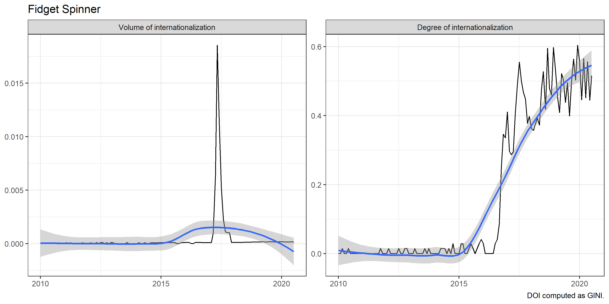{width=100%}

In the `globaltrends` package, we provide a tailor-made operationalization of internationalization that relies on the global recognition of objects of interest. This complements traditional approaches in international business research that approximate the configuration of a firm’s international operations. Our package allows users to download time series of Google search volumes from 2004 onwards. Because Google Trends organizes its data output as single-country keyword batches, the package uses batched downloads. Within these batches, Google Trends normalizes search volumes to values between 0 and 100. We devise a mapping algorithm to transform Google Trends output to a more general data structure. For each country, `globaltrends` downloads a set of control keywords that captures “standard” search volumes in the country. Then, the package downloads batches of company names, including synonyms and alternative spellings, for each country. We follow Castelnuovo and Tran (2017) to implement a mapping of search volumes for firms to search volumes for control keywords in each country. The package then uses these time series to compute search scores as the ratio between search volumes for a firm in comparison to search volumes for control keywords in each country. We offer a detailed outline of this approach in the [Appendix B](#appendix-b).  

Search scores are interpretable as the proportion of search volumes for an object of interest compared to search volumes for control keywords within a country. Search scores therefore allow comparison across different types of objects (e.g., firms, persons, products…), time periods, and countries and provide insights into the local relevance of objects and their exposure to the respective countries.

## Volume of internationalization (VOI)
Country search scores focus on search volumes for objects in single countries. To compute an object’s volume of internationalization, we focus on global search volumes instead of country search volumes. Using the same approach as outlined above, `globaltrends` first downloads global search volumes for each control keyword and firm. Next, the package runs the control-object mapping and computes global search scores as the ratio of global search volumes for each object and global control search volumes.  

Like country search scores, we can interpret global search scores as the proportion of global search volumes for an object of interest compared to global search volumes for control keywords. This allows researchers to track changes in global interest in objects and highlights phases of fast or receding internationalization. Since the computation of country and global search scores follows the same procedures, the two measures have the same properties. This provides for a direct comparison between country search scores and volume of internationalization in terms of global search scores.

## Degree of internationalization (DOI)
As the main measure for degree of internationalization, the `globaltrends` package uses the global dispersion of country search scores. The more uniform the distribution of search scores across countries, the higher an object’s degree of internationalization. When the distribution of country search scores is highly skewed, with high search scores in the object’s country of origin and low search scores in other countries, the object has a low degree of internationalization. To compute an object’s degree of internationalization, the packages by default uses as the inverted Gini coefficient.

# Case study: Analyzing firm internationalization
We demonstrate the functionality of the `globaltrends` package based on a sample of six large U.S. firms. Measuring degree of internationalization for firms is an essential empirical task in international business research. Yet the proposed methodology can be generalized to other applications. In this brief case study, we analyze the degree of internationalization of *Alaska Air Group Inc.*, *Coca-Cola Company*, *Facebook Inc.*, *Illinois Tool Works Inc.*, *J.M. Smucker Company*, and *Microsoft Corporation*. The workflow proceeds in four major steps:

1. Setup and start database
2. Download data from Google Trends
3. Compute search scores and internationalization
4. Exports and plots

## Setup and start database
Research projects that use Google Trends generate a substantial amount of data. To optimally handle this data, the `globaltrends` package uses an [SQLite database](https://www.sqlite.org/index.html) to store and handle all data. This ensures efficiency and portability on the one hand and seamless integration with functions implemented in the `DBI` and `dplyr` packages on the other hand.  

Users create the underlying database through the `initialize_db` command. The command creates a folder named *db* within the current working directory and creates an SQLite database file named *globaltrends_db.sqlite* within this folder. The command also creates all necessary tables within the database. For more information on database tables, please refer to their built-in documentation e.g., `?globaltrends::data_score`. The database initialization is necessary only for the first usage of the `globaltrends` package.

```{r, eval = FALSE}
# initialize_db ----------------------------------------------------------------
setwd("your/globaltrends/folder")
initialize_db()
#> Database has been created.
#> Table 'batch_keywords' has been created.
#> ...
#> Table 'data_global' has been created.
#> Successfully disconnected.
```

After initialization or when resuming work on an existing database it is sufficient to call `start_db` from the respective working directory. This command connects to the *globaltrends_db.sqlite* database in the folder *db* and creates connections to all tables in the database.

```{r, eval = FALSE}
# start_db ---------------------------------------------------------------------
setwd("your/globaltrends/folder")
start_db()
#> Successfully connected to database.
#> Successfully exported all objects to .GlobalEnv.
print(ls())
#>  [1] "batch_keywords"   "batch_time"       "countries"        "data_control"
#>  [5] "data_doi"         "data_global"      "data_locations"   "data_mapping"
#>  [9] "data_object"      "data_score"       "dir_current"      "dir_wd"
#> [13] "globaltrends_db"  "keyword_synonyms" "keywords_control" "keywords_object"
#> [17] "time_control"     "time_object"      "us_states"
```

After work with the `globaltrends` package is complete, the user disconnects from the database with the command `disconnect_db`.

```{r, eval = FALSE}
# disconnect_db ----------------------------------------------------------------
disconnect_db()
#> Successfully disconnected.
```

## Download data from Google Trends
The next step in the `globaltrends` workflow is data download from Google Trends. The `globaltrends` package includes four types of download functions that we explain in detail below. Each of these functions uses the `gtrendsR::gtrends` function to access the Google Trends API. The Google Trends API allows inputs of up to five keywords for a given location and period. Therefore, the `globaltrends` package works with “keyword batches” that combine up to five keywords (see [Appendix A](appendix-a) for a discussion of data manipulation applied by Google). The respective batch numbers are an input to all functions – either as `list` or as single `integer` objects. In the package, we distinguish two types of batches: **control** batches that include keywords indicating baseline search activity and **object** batches that include keywords relating to the objects of interest (e.g., firms, persons, products…). Currently, `globaltrends` only includes two sets of locations. The *countries* set, which covers all countries that generated at least 0.1% of world GDP in 2018 and the *us_states* set, covering all US states and Washington DC, see [below](#changing-locations) for further details.   

The download for a single keyword batch for a single location takes about 10 seconds. This includes a randomized waiting period of 5-10 seconds between downloads. Depending on download frequency, Google Trends might block users for some time. Unfortunately, the exact download limits are unknown ([Issue #140](https://github.com/PMassicotte/gtrendsR/issues/140), [Issue #255](https://github.com/PMassicotte/gtrendsR/issues/255)). In this case, `globaltrends` waits 1 minute before it retries the download.

### Download control data
First, we add a batch of control keywords to the database using `add_control_keyword`. Since *gmail*, *maps*, *translate*, *wikipedia*, and *youtube* allow an approximation of “standard” search volumes on Google, we propose them as control keywords for global trend analysis. The `globaltrends` package also allows the usage of [search topics](#search_topics_vs_search_terms) instead of individual search terms as keywords. These keywords approximate the baseline search traffic on Google. For specific research settings, we suggest adapting keywords to the respective setting and testing them on the [Google Trends portal](https://trends.google.com/trends/) beforehand. The output of `add_control_keyword` is a `list` object of new control batch numbers that can serve as input for other functions.

```{r, eval = FALSE}
# add_control_keyword ----------------------------------------------------------
new_control <- add_control_keyword(
  keyword = c("gmail", "maps", "translate", "wikipedia", "youtube"),
  time = "2010-01-01 2020-12-31"
)
#> Successfully created new control batch 1 (gmail ... youtube, 2010-01-01 2020-12-31).
```

The function `add_control_keyword` also updates the object `keywords_control` in the global environment. This `tibble` can be used for batch lookup.

```{r, eval = FALSE}
# keywords_control and dplyr interaction ---------------------------------------
dplyr::filter(keywords_control, keyword == "gmail")
#> # A tibble: 1 x 2
#>   batch keyword
#>   <int> <chr>
#> 1     1 gmail
```

As a second step, we download the control data with `download_control`, using the output from `add_control_keyword` as `control` input, the numbers of control batches for which we want to download data. The input defaults to `countries`, see [below](#changing-locations) for further details.   

```{r, eval = FALSE}
# download_control -------------------------------------------------------------
download_control(control = new_control, locations = countries)
#> Successfully downloaded control data | control: 1 | location: US [1/66]
#> ...
#> Successfully downloaded control data | control: 1 | location: DO [66/66]
```

A message indicates each successful download of search volumes for control keywords. The data is written directly to the table *data_control* in the database. The function `download_control_global` follows the same approach and downloads control data on a global level.

```{r, eval = FALSE}
# download_control_global ------------------------------------------------------
download_control_global(control = new_control)
#> Successfully downloaded control data | control: 1 | location: world [1/1]
```

### Download object data
For object data, as for control data, the first step is to add keywords that correspond to the objects of interest. While we use a single control batch for the entire analysis, there are more than one object batch. To each object batch, a control keyword is added to allow mapping between control and object search volumes (further details [below](#compute-country-search-scores-and-volume-of-internationalization)). Therefore, the number of keywords is limited to four, rather than five as for control batches. Before we add the object keywords, we clean them, deleting punctuation and form of incorporation: *alaska air group*, *coca cola*, *facebook*, *illinois tool works*, *jm smucker*, and *microsoft*. Since this affects search results, the transformation requires substantial consideration and depends on the respective research setting. The `globaltrends` package also allows the usage of [search topics](#search_topics_vs_search_terms) instead of individual search terms as keywords. To ensure the expected results, we propose testing keyword transformations on the [Google Trends portal](https://trends.google.com/trends/) beforehand.

```{r, eval = FALSE}
# add_object_keyword -----------------------------------------------------------
new_object <- add_object_keyword(
  keyword = list(
    c("coca cola", "facebook", "microsoft"),
    c("alaska air group", "illinois tool works", "jm smucker")
  ),
  time = "2010-01-01 2020-12-31"
)
#> Successfully created new object batch 1 (coca cola ... microsoft, 2010-01-01 2020-12-31).
#> Successfully created new object batch 2 (alaska air group ... jm smucker, 2010-01-01 2020-12-31).
```

As for control keywords, the function `add_object_keyword` also updates the object `keywords_object` in the global environment. This `tibble` can be used for batch lookup.

```{r, eval = FALSE}
# keywords_object and dplyr interaction ----------------------------------------
dplyr::filter(keywords_object, keyword == "coca cola")
#> # A tibble: 1 x 2
#>   batch keyword
#>   <int> <chr>
#> 1     1 coca cola
```

Again, the second step is to download the object data with `download_object`, using the output from `add_object_keyword` as `object` input, the numbers of object batches for which we want to download data. As above, the input `locations` defaults to `countries`. The package automatically adds a control keyword to each batch of four object keywords. This control keyword then allows a mapping between control batches and object batches.

```{r, eval = FALSE}
# download_object --------------------------------------------------------------
download_object(object = new_object, locations = countries)
#> Successfully downloaded object data | object: 1 | location: US [1/66]
#> ...
#> Successfully downloaded object data | object: 2 | location: DO [66/66]
```

A message indicates each successful download of search volumes for object keywords. The data is written directly to the table *data_object* in the database. The function `download_object_global` follows the same approach and downloads object data on a global level.

```{r, eval = FALSE}
# download_object_global -------------------------------------------------------
download_object_global(object = new_object)
#> Successfully downloaded object data | object: 1 | location: world [1/1]
#> Successfully downloaded object data | object: 2 | location: world [1/1]
```

## Compute search scores and internationalization
Once the user has completed all control and object downloads, `globaltrends` computes search scores for each keyword-time-location combination and at a global level (*volume of internationalization*). Next, the package uses the across-country distribution of these search scores to measure the *degree of internationalization* of an object keyword.

### Compute country search scores and volume of internationalization
The function `compute_score` divides the search volumes for an object keyword by the sum of search volumes for the keywords in the respective control batch. The search score computation proceeds in four steps. First, the function aggregates all search volumes to monthly data. Then, it applies some optional time series adjustments that we outline in greater detail [below](#time-series-adjustments). Next, it follows the procedure proposed by Castelnuovo and Tran (2017, pp. A1-A2) and outlined in the [Appendix B](#appendix-b) to map control and object data. After the mapping, object search volumes are divided by the sum of control search volumes in the respective control batch. We use the sum of search volumes for a set of control keywords, rather than the search volumes for a single control keyword, to smooth-out variation in the underlying control data. Because of this division, it is essential to define a set of control keywords that mirrors “standard” Google usage for the given research setting.

```{r, eval = FALSE}
# compute_score ----------------------------------------------------------------
compute_score(control = new_control[[1]], object = new_object, locations = countries)
#> Successfully computed search score | control: 1 | object: 1 | location: US [1/66]
#> ...
#> Successfully computed search score | control: 1 | object: 2 | location: DO [66/66]
```

A message indicates each successful computation of search scores. The data is written directly to table *data_score* in the database. The computation of the volume of internationalization follows the same principles. Instead of search volumes of control and object keywords at the country level, the function `compute_voi` compares control and object search volumes at the global level.

```{r, eval = FALSE}
# compute_voi ------------------------------------------------------------------
compute_voi(control = new_control[[1]], object = new_object)
#> Successfully computed search score | control: 1 | object: 1 | location: world [1/1]
#> Successfully computed search score | control: 1 | object: 2 | location: world [1/1]
```

### Compute degree of internationalization
The `globaltrends` package uses the distribution of search scores across countries to compute degree of internationalization for objects of interest. The function `compute_doi` uses an inverted Gini-coefficient as measure for degree of internationalization. The more uniform the distribution of search scores across all countries, the higher the inverted Gini-coefficient and the greater the degree of internationalization. In addition to the Gini-coefficient, the package uses inverted Herfindahl index and inverted Entropy as measures for internationalization ([details below](#alternative-dispersion-measures)).

```{r, eval = FALSE}
# compute_doi ------------------------------------------------------------------
compute_doi(control = new_control[[1]], object = new_object, locations = "countries")
#> Successfully computed DOI | control: 1 | object: 1 [1/2]
#> Successfully computed DOI | control: 1 | object: 2 [2/2]
```

A message indicates each successful computation. The data is written directly to table *data_doi* in the database.

## Exports and plots
Functions in `globaltrends` write all data directly to tables in the database. With the help of functions from the `dplyr` package and connections exported from `start_db`, users can access database tables and prepare their own analysis.

```{r, eval = FALSE}
# manual exports ---------------------------------------------------------------
library(dplyr)
data_score %>%
  filter(keyword == "coca cola") %>%
  collect()
#> # A tibble: 8,040 x 8
#>    location keyword    date score_obs score_sad score_trd batch_c batch_o
#>    <chr>    <chr>     <int>     <dbl>     <dbl>     <dbl>   <int>   <int>
#>  1 US       coca cola 14610   0.00362   0.00381   0.00548       1      1
#>  ...
#> 10 US       coca cola 14883   0.00347   0.00365   0.00389       1      1
#> # ... with 8,030 more rows
```

To enhance usability, the `globaltrends` package includes a set of export functions that offer filters and return data as `tibble`. The default value for the batch/keyword, for which `export_xxx` exports data is `NULL`. In this case, all values from the database are exported. Alternatively, users can specify filters (e.g., keywords, batches, locations) individually, as vector or as list.

```{r, eval = FALSE}
# export_control ---------------------------------------------------------------
export_control(control = 1)
#> # A tibble: 39,600 x 5
#>    location keyword date        hits control
#>    <chr>    <chr>   <date>     <dbl>   <int>
#>  1 US       gmail   2010-01-01    22       1
#>  ...
#> 10 US       gmail   2010-10-01    27       1
#> # ... with 39,590 more rows

# export_score -----------------------------------------------------------------
export_score(object = 1, control = 1)
#> # A tibble: 23,760 x 8
#>    location keyword   date       score_obs score_sad score_trd control object
#>    <chr>    <chr>     <date>         <dbl>     <dbl>     <dbl>   <int>  <int>
#>  1 US       coca cola 2010-01-01   0.00362   0.00381   0.00548       1     1
#>  ...
#> 10 US       coca cola 2010-10-01   0.00347   0.00365   0.00389       1     1
#> # ... with 23,750 more rows

# export_doi and purrr interaction ---------------------------------------------
purrr::map_dfr(c("coca cola", "microsoft"), export_doi, control = 1, type = "obs")
#> # A tibble: 240 x 9
#>    keyword   date       type       gini   hhi entropy control object locations
#>    <chr>     <date>     <chr>     <dbl> <dbl>   <dbl>   <int>  <int> <chr>    
#>  1 coca cola 2010-01-01 score_obs 0.397 0.874  -0.938       1     1 countries
#>  ...
#> 10 coca cola 2010-10-01 score_obs 0.574 0.968  -0.303       1     1 countries
#> # ... with 230 more rows
```

The export functions from `globaltrends` also allow direct interaction with `dplyr` or other packages for further analysis.

```{r, eval = FALSE}
# export and dplyr interaction -------------------------------------------------
library(dplyr)
export_doi(object = 1, control = 1, type = "obs") %>%
  filter(lubridate::year(date) == 2019) %>%
  group_by(keyword) %>%
  summarise(gini = mean(gini), .groups = "drop")
#> # A tibble: 3 x 2
#>   keyword    gini
#>   <chr>     <dbl>
#> 1 coca cola 0.615
#> 2 facebook  0.707
#> 3 microsoft 0.682
```

Exports from `globaltrends` also serve as input for plot functions and the computation of abnormal changes in internationalization implemented in the package. Except for `plot_voi_doi`, plot functions have methods for classes of outputs from `export_score`, `export_voi`, and `export_doi`. Alternatively, all plot-functions provide options to work without the respective class e.g., for cases where the class gets lost in a `join`. The function `plot_bar` uses the output from `export_score` as input and shows the locations with the highest search scores for a given object keyword. The function uses only the first keyword in the dataset and averages the search scores for the input dataset – we therefore suggest filtering the output from `export_score` to a specific period. The plot shows that Coca-Cola has high search scores across Latin America and India.

```{r, eval = FALSE}
# plot_score -------------------------------------------------------------------
library(dplyr)
export_score(keyword = "coca cola", control = 1) %>%
  filter(lubridate::year(date) == 2019) %>%
  plot_bar()
```

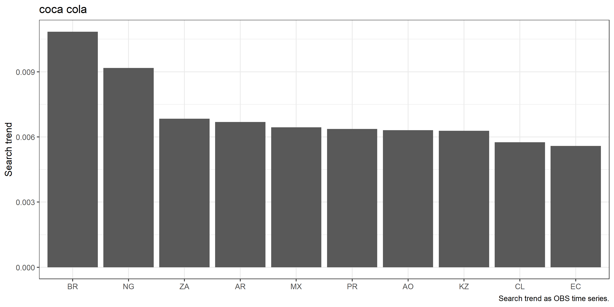{width=100%}

The functions `plot_box` and `plot_ts` have methods for classes of output from `export_score`, `export_voi`, and `export_doi`. The time series plot function `plot_ts` shows how search scores and volume or degree of internationalization for objects of interest develops over time. The function `plot_box` generates boxplots of search score and volume or degree of internationalization distributions. The four plots below compare volume and degree of internationalization for the six companies in our sample. At first glance, we see that Coca-Cola, Facebook, and Microsoft have higher degrees of internationalization than Alaska Air Group, Illinois Tool Works, and J.M. Smucker. It seems as if the degree of internationalization of Facebook and Microsoft increased slightly from 2010 to 2015. Although the overall trend remains stable, Coca-Cola shows greater variation than the other companies.

```{r, eval = FALSE}
# plot_doi_ts and plot_doi_box -------------------------------------------------
data <- purrr::map_dfr(1:2, export_doi, keyword = NULL, control = 1, type = "obs")
plot_ts(data)
plot_box(data)
```

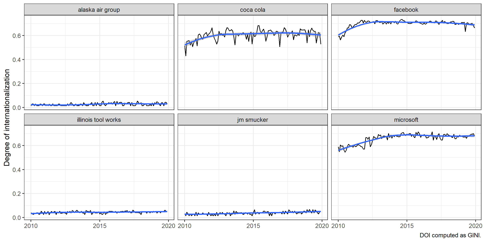{width=100%}

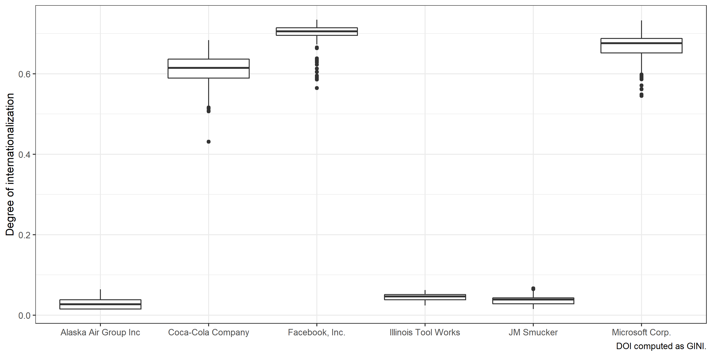{width=100%}

With the function `plot_voi_doi`, users can compare the volume of internationalization for an object of interest to its degree of internationalization. Like `plot_bar`, the function uses only the first keyword in a dataset, filtering might be necessary. In the plot below, we compare Facebook’s volume of internationalization to its degree of internationalization. While volume of internationalization indicates the level of global search scores, degree of internationalization relates to the global distribution of search scores. We see that Facebook’s volume of internationalization constantly decreased after its peak in 2013. At the same time, we observe that its degree of internationalization grew from 2010 before peaking in 2013.

```{r, eval = FALSE}
# plot_voi_doi -----------------------------------------------------------------
out_voi <- export_voi(keyword = "facebook", type = "obs")
out_doi <- export_doi(keyword = "facebook", object = 1, type = "obs")
plot_voi_doi(data_voi = out_voi, data_doi = out_doi)
```

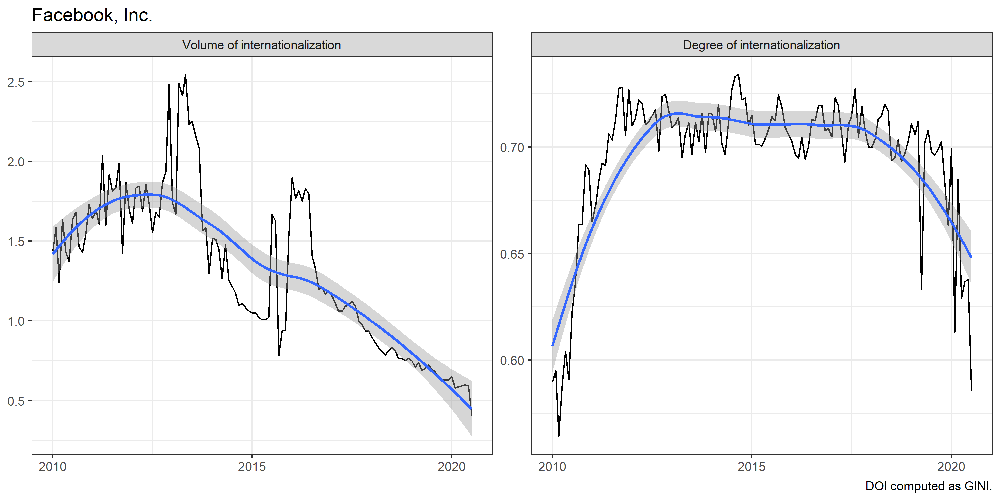{width=100%}

## Abnormal changes in internationalization
A unique feature of internationalization data from `globaltrends` is that it allows time series analysis. For a better understanding of changes in the data, the function provides the `get_abnorm_hist` function that implements functionality used in financial event studies (MacKinlay, 1997; McWilliams & Siegel, 1997). The function compares search scores and volume or degree of internationalization to a historic baseline. By default, the historic baseline is the average from the preceding twelve months. Users can specify the window of the baseline period (`train_win`) and a can use a break between baseline and date of interest (`train_break`). Since they are used as baseline, the first `train_win + train_break` abnormal changes are `NA`. The `get_abnorm_hist` function has methods for classes of outputs from `export_score`, `export_voi`, and `export_doi`. For each month in the dataset, the deviation from the historic baseline is computed. To identify abnormal changes, the function provides the percentile rank for each change within the distribution of changes.

```{r, eval = FALSE}
data <- export_score(keyword = "facebook", locations = countries)
out <- get_abnorm_hist(data)
na.omit(out) # to drop baseline NA values
#> # A tibble: 7,590 x 8
#>   keyword  location date       control object score score_abnorm quantile
#>   <chr>    <chr>    <date>       <int>  <int> <dbl>        <dbl>    <dbl>
#>  1 facebook US       2011-01-01       1      1  1.19      0.0220     0.728
#>  ...
#> 10 facebook US       2011-10-01       1      1  1.32     -0.0669     0.456
#> # ... with 7,580 more rows

data <- export_voi(object = 1)
out <- get_abnorm_hist(data)
na.omit(out) # to drop baseline NA values
#> # A tibble: 345 x 7
#>    keyword   date       control object     voi voi_abnorm quantile
#>    <chr>     <date>       <int>  <int>   <dbl>      <dbl>    <dbl>
#>  1 coca cola 2011-01-01       1      1 0.00320  -0.000299    0.316
#>  ...
#> 10 coca cola 2011-10-01       1      1 0.00274  -0.000458    0.193
#> # ... with 335 more rows

data <- export_doi(keyword = "microsoft", locations = "us_states")
out <- get_abnorm_hist(data)
na.omit(out) # to drop baseline NA values
#> # A tibble: 345 x 9
#>    keyword   date       type      control object locations   doi doi_abnorm quantile
#>    <chr>     <date>     <chr>       <int>  <int> <chr>     <dbl>      <dbl>    <dbl>
#>  1 microsoft 2011-01-01 score_obs       1      1 us_states 0.919    0.0330     0.991
#>  ...
#> 10 microsoft 2011-04-01 score_obs       1      1 us_states 0.909    0.0171     0.886
#> # ... with 335 more rows
```

The functions `plot_bar`, `plot_box`, and `plot_ts` have methods for classes of output from `get_abnorm_hist`. This allows seamless plotting of changes in internationalization. The function `plot_bar` shows the five locations with the highest and lowest changes in search scores for a given object keyword. The function uses only the first keyword in the dataset and averages changes in search scores for the input dataset – we therefore suggest filtering the output from ` get_abnorm_hist` to a specific period. The plot shows that while positive abnormal changes in search scores for Facebook were greatest in Ecuador and Myanmar, negative abnormal changes were greatest in Italy and Argentina.

```{r, eval = FALSE}
data <- export_score(object = 1, locations = countries)
data <- dplyr::filter(data, keyword == "facebook" & lubridate::year(date) >= 2018)
# use 2018 as baseline to compute abnormal changes in 2019
out <- get_abnorm_hist(data)
plot_bar(out)
```

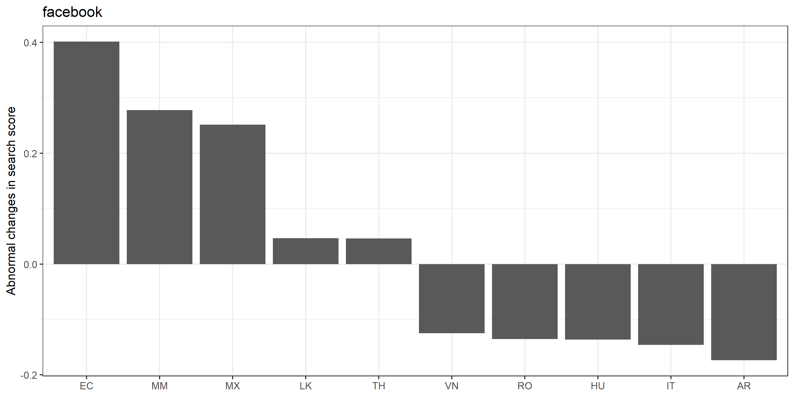{width=100%}

The time series plot function `plot_ts` shows how search scores and volume or degree of internationalization for objects of interest changed over time. The function `plot_box` generates boxplots of changes in search score and volume or degree of internationalization distributions. The input `ci` allows users to set a confidence interval for plotting. Changes with percentile ranks outside this two-tailed confidence interval are highlighted with red dots. The left-hand plot shows abnormal changes in Facebook’s search score for Germany. Search scores increased “abnormally” (i.e., compared to the historic average) in 2012 and decreased abnormally in 2014. The right-hand plot shows the distribution for Coca Cola’s degree of internationalization and indicates abnormal changes.

```{r, eval = FALSE}
data <- export_score(keyword = "facebook", locations = "DE")
out <- get_abnorm_hist(data)
plot_ts(out)

data <- export_doi(keyword = "coca cola", locations = "countries")
out <- get_abnorm_hist(data)
plot_box(out)
```

<center>
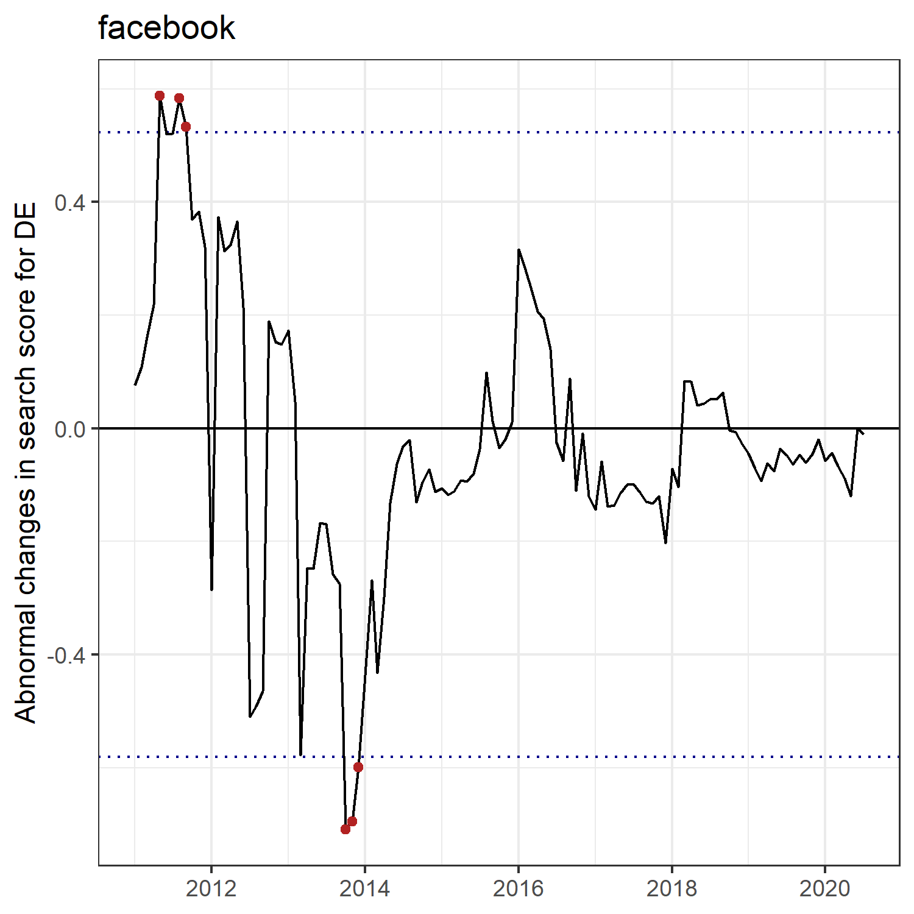{height=45%, width=45%}
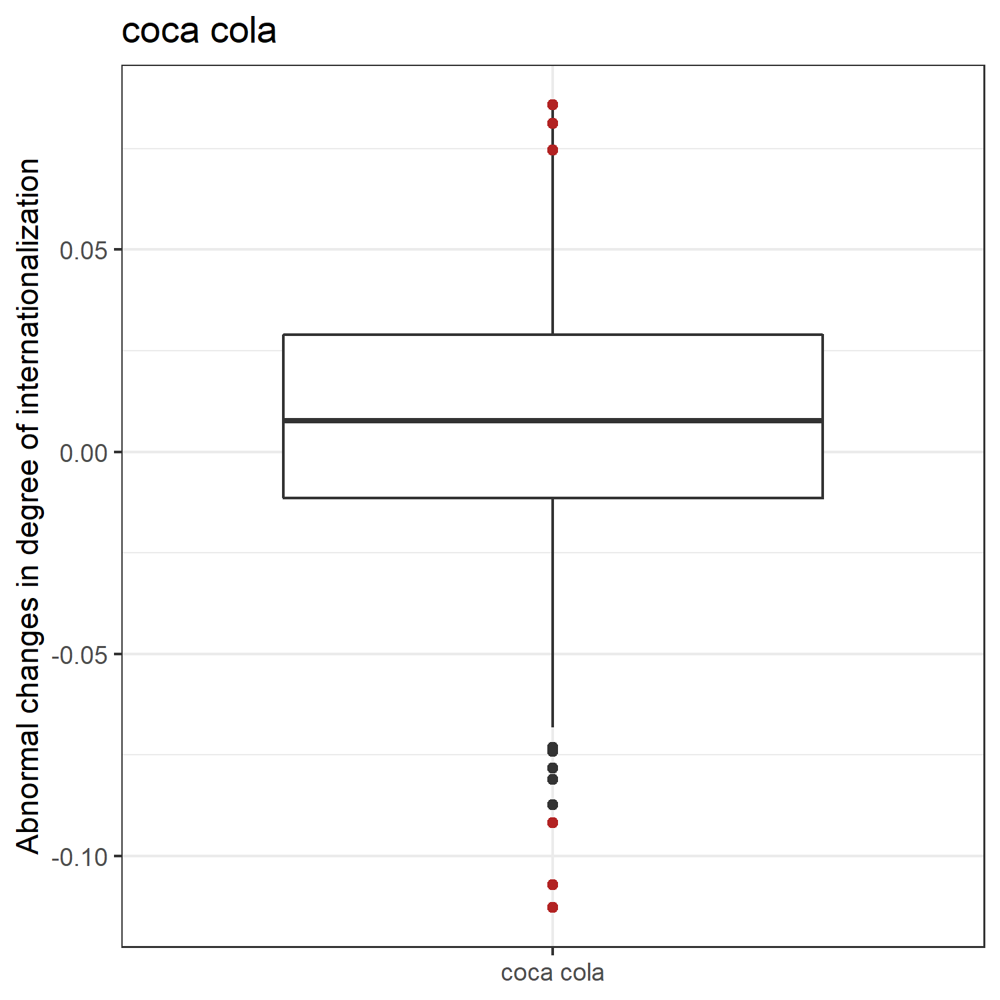{height=45%, width=45%}
</center>

## Additional options
The `globaltrends` package offers several options that allow robustness checks and adjustments for default computations. Users can compute global trend dispersion based on different types of time series, use other measures than the inverted Gini-coefficient, or change the set of locations.

### Time series adjustments
The computation of search scores in the `globaltrends` package compares a time series of search volumes for object keywords to the time series of search volumes for control keywords. Noise and seasonality in search volume time series could affect the resulting search scores. The `globaltrends` package offers two time series adjustments as robustness checks. In the `data_score` table, column `score_obs` refers to values without adjustment. Column `score_trd` uses the underlying time series’ trend for computation.

```{r, eval = FALSE}
# computation seasonally adjusted ----------------------------------------------
search_score <- ts(data$hits, frequency = 12)
fit <- stl(search_score, s.window = "period")
trend <- fit$time.series[, "trend"]
# computation trend only -------------------------------------------------------
search_score <- ts(data$hits, frequency = 12)
fit <- stl(search_score, s.window = "period")
seasad <- forecast::seasadj(fit)
```

Column `score_sad` corrects the time series for seasonal patterns. In general, outcomes for all three types of time series are similar. Column `score_trd` applies the greatest smoothing, while `score_sad` reduces some noise.

<center>
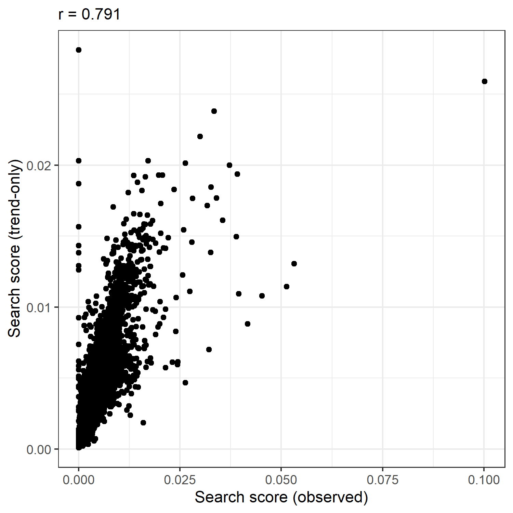{height=45%, width=45%}
{height=45%, width=45%}
</center>

The `export_doi`, `get_abnorm_hist`, `plot_bar`, `plot_ts`, `plot_box`, and `plot_voi_doi` functions allow filtering for the type of time series through the `type` input.

```{r, eval = FALSE}
# adapt export and plot options ------------------------------------------------
data_score <- export_score(keyword)
data_voi <- export_voi(keyword)
data_doi <- export_doi(keyword, type = "obs")

plot_bar(data_score, type = "obs")
plot_ts(data_voi, type = "sad")
plot_box(data_doi, type = "trd")
plot_voi_doi(data_voi, data_doi, type = "obs")

get_abnorm_hist(data_voi, type = "obs")
```

### Alternative dispersion measures
The `globaltrends` package computes degree of internationalization based on the across-location distribution of search scores. By default, the package uses an inverted Gini-coefficient. In addition, the package provides inverted Herfindahl index and inverted Entropy as robustness checks. In general, outcomes for all three dispersion measures are similar.

```{r, eval = FALSE}
# computation inverted gini coefficient ----------------------------------------
dplyr::coalesce(1 - ineq::ineq(search_score, type = "Gini"), 0)
# computation inverted herfindahl index ----------------------------------------
dplyr::coalesce(1 - sum((search_score / sum(search_score))^2), 0)
# computation inverted entropy -------------------------------------------------
dplyr::coalesce(-1 * ineq::ineq(search_score, parameter = 1, type = "entropy"), 0)
```

<center>
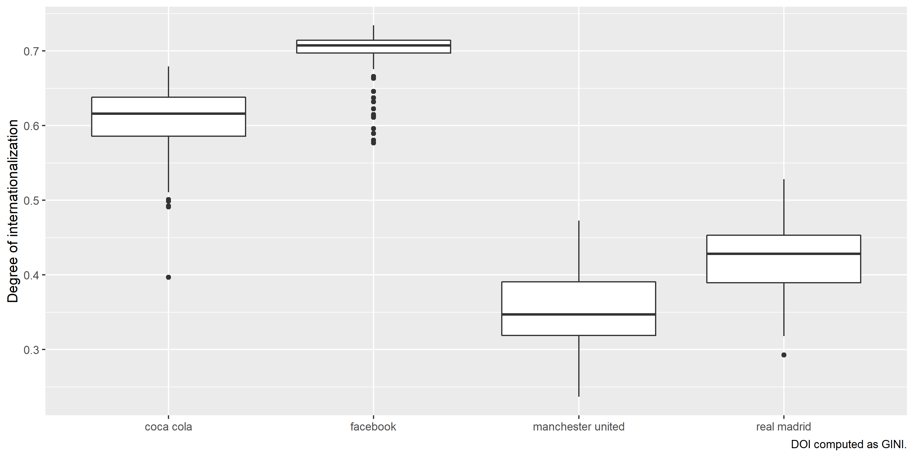{height=45%, width=45%}
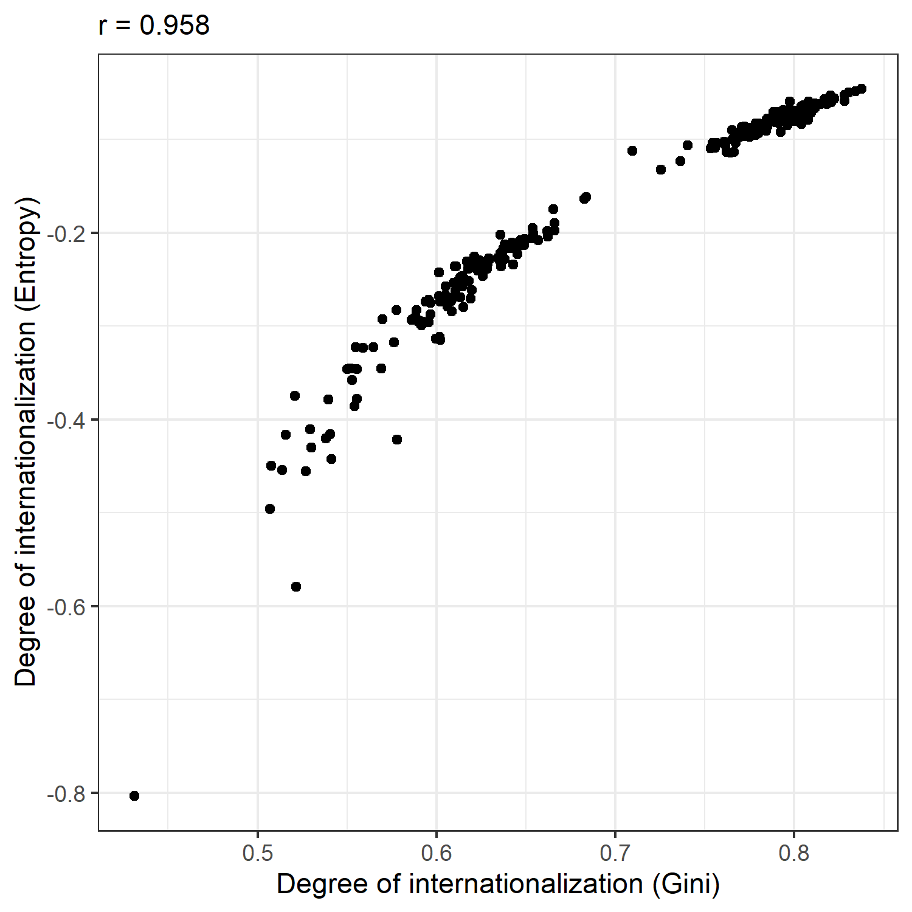{height=45%, width=45%}
</center>

The `export_doi`, `get_abnorm_hist`, `plot_ts`, `plot_box`, and `plot_voi_doi` functions allow filtering for the type of dispersion measures through the `measure` input.

```{r, eval = FALSE}
# adapt export and plot options ------------------------------------------------
data_voi <- export_voi(keyword)
data_doi <- export_doi(keyword, measure = "gini")

plot_ts(data_doi, measure = "gini")
plot_box(data_doi, measure = "hhi")
plot_voi_doi(data_voi, data_doi, measure = "entropy")

get_abnorm_hist(data_doi, measure = "hhi")
```

### Alternative sets of locations
By default, `globaltrends` makes all downloads and computations for the *countries* set of locations. The *countries* set covers all countries that generated at least 0.1% of world GDP in 2018. By changing the input `locations` to *us_states*, the package uses US states and Washington DC as basis for downloads and computations instead. Apart from `compute_doi`, all functions use the name of the variable that contains the location vector as inputs for `locations` (e.g., *countries*, *us_states*). The function `start_db` exports these vectors of ISO2 codes to the global environment. Function `compute_doi`, however does not directly refer to these objects, but to their names (e.g., “countries”, “us_states”). Using state or district level locations allows users to analyze within-country dispersion of firms.

```{r, eval = FALSE}
# change locations -------------------------------------------------------------
download_control(control = 1, locations = us_states)
download_object(object = list(1,2), locations = us_states)
download_mapping(control = 1, object = 2, locations = us_states)
compute_score(control = 1, object = 2, locations = us_states)
compute_doi(control = 1, object = list(1,2), locations = "us_states")
```

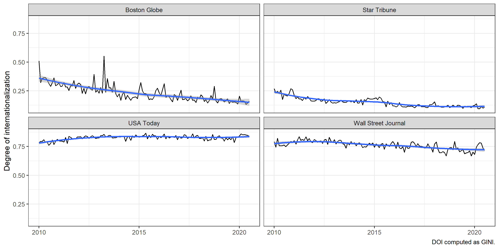{width=100%}

Users can add individual sets of locations through the function `add_locations`. In the variable `locations`, users specify the location codes (e.g., “AT”, “CH”, “DE”) and `type` takes the name of the location set (e.g., “DACH”). The new location set can be used in all functions. Since all functions check whether data on a location already exists, `globaltrends` does not duplicate data for new location sets.

```{r, eval = FALSE}
add_locations(c("AT", "CH", "DE"), type = "dach")
#> Successfully created new location set dach (AT, CH, DE).
data <- export_score(keyword = "coca cola", locations = dach)
dplyr::count(data, location)
#> # A tibble: 3 x 2
#>   location     n
#>   <chr>    <int>
#> 1 AT         127
#> 2 CH         127
#> 3 DE         127
```

# Search topics vs search terms
Results for individual keywords as search terms (e.g., *weather*, *apple*, *coca cola*) might be distorted by translation issues (i.e., keywords are search for in different languages), keyword contamination (i.e., keywords relate to different queries: apple vs. Apple Inc.), and keyword dilution (i.e., multiple keywords relate to the same query: election, vote). Search topics allow users to partly overcome these issues. [Google](https://support.google.com/trends/answer/4359550) defines a search topic as “a group of terms that share the same concept in any language.” Thereby, queries that use search topics are language-independent, cover queries for different terms, and differentiate between queries.  

Users can identify the codes of search topics on the Google Trends portal, by selecting the respective topic, rather than a search term (see the screenshot below).

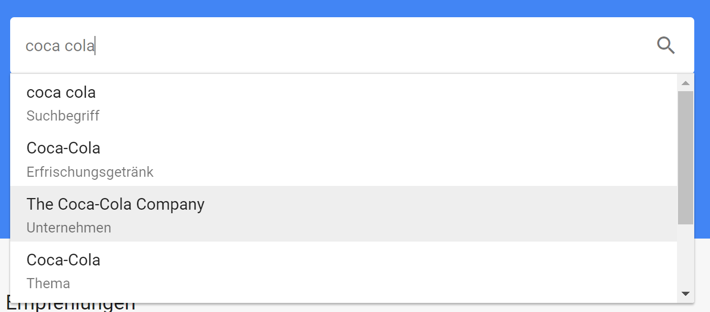{width=100%}

After selecting the relevant search topics, users can identify the topic codes in the query’s URL. For example, based on the URL [https://trends.google.com/trends/explore?q=%2Fm%2F03phgz&geo=AT](https://trends.google.com/trends/explore?q=%2Fm%2F03phgz&geo=AT) the topic *The Coca-Cola Company* is *%2Fm%2F03phgz*. Users can use these topic codes as keywords instead of single search terms. We point users to Kupfer and Zorn (2020, pp. 1169-1170) for a detailed comparison of search topics and search terms.  

**Important:** We recommend that search topics for control keywords are used in combination with search topics for object keywords and vice versa.

# Further applications
To measure degree of internationalization, `globaltrends` offers a wide array of empirical possibilities  (Puhr & Müllner, 2021). It allows researchers to compare degree of internationalization for various organizations on a unified scale (e.g., *Coca-Cola Company*, *Facebook Inc.*, *Real Madrid*, and *Manchester United*). In addition, the time-series nature of Google Trends allows for historical analysis of internationalization patterns and speed within organizations.

{width=100%}

The enormous detail of the data opens additional applications in research that are impossible with traditional measures of internationalization. For instance, using `globaltrends` on a subnational level (e.g., `locations = us_states`) allows researchers to study proliferation within a country and, for example, to trace a particular market entry. In addition, `globaltrends` offers applications beyond corporate internationalization, such as data on global interest in products, persons, events, social trends or scandals.

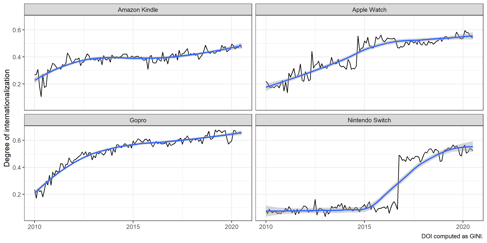{width=100%}

***

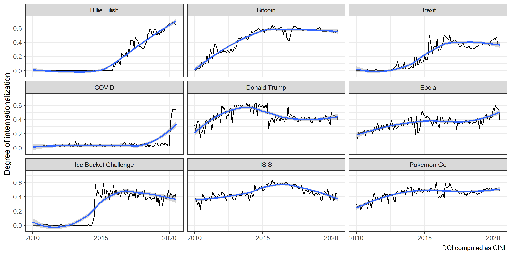{width=100%}

***

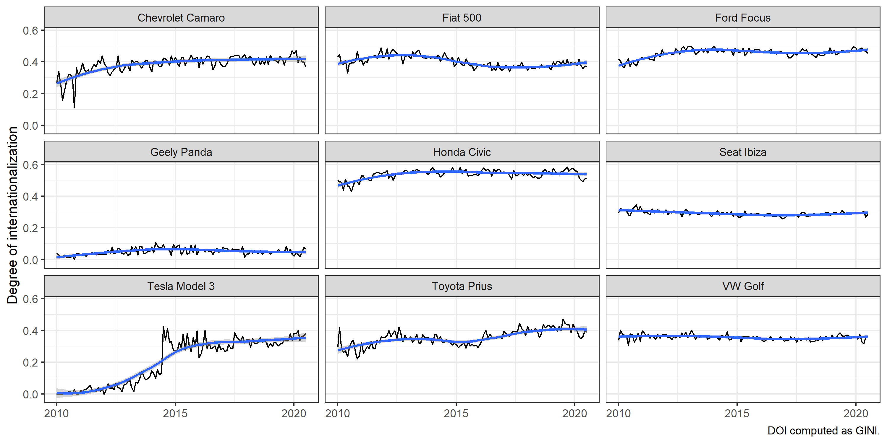{width=100%}

# References
* Castelnuovo, E. & Tran, T. D. 2017. Google It Up! A Google Trends-based uncertainty index for the United States and Australia. *Economics Letters*, 161: 149-153.
* Costola, M., Iacopini, M., & Santagiustina, C. R. M. A. (2021). Google search volumes and the financial markets during the COVID-19 outbreak. *Finance Research Letters*, 42: 101884.
* Kupfer, A. & Zorn, J. 2020. A language-independent measurement of economic policy uncertainty in Eastern European countries. *Emerging Markets Finance and Trade*, 56(5): 1166-1180.
* MacKinlay, A. C. 1997. Event studies in economics and finance. *Journal of Economic Literature*, 35(1): 13-39.
* McWilliams, A. & Siegel, D. 1997. Event studies in management research: Theoretical and empirical issues. *Academy of Management Journal*, 40(3): 626-657.
* Puhr, H., & Müllner, J. (2021). Let me Google that for you: Capturing globalization using Google Trends (*SSRN Working Paper 3969013*). Available at [https://ssrn.com/abstract=3969013](https://ssrn.com/abstract=3969013).
* Puhr, H., & Müllner, J. (2022). Foreign to all but fluent in many: The effect of multinationality on shock resilience. *Journal of World Business*, 57(6): 101370.

# Appendix A
Appendix A
Google Trends does not query the total population of search queries on Google—an impossible task given the massive volume of data involved. Users specify which keyword $ko$ they want to query for location $l$ within timeframe $T$. We follow Costola, Iacopini, and Santagiustina (2021) to illustrate the data preparation steps applied by Google below.  

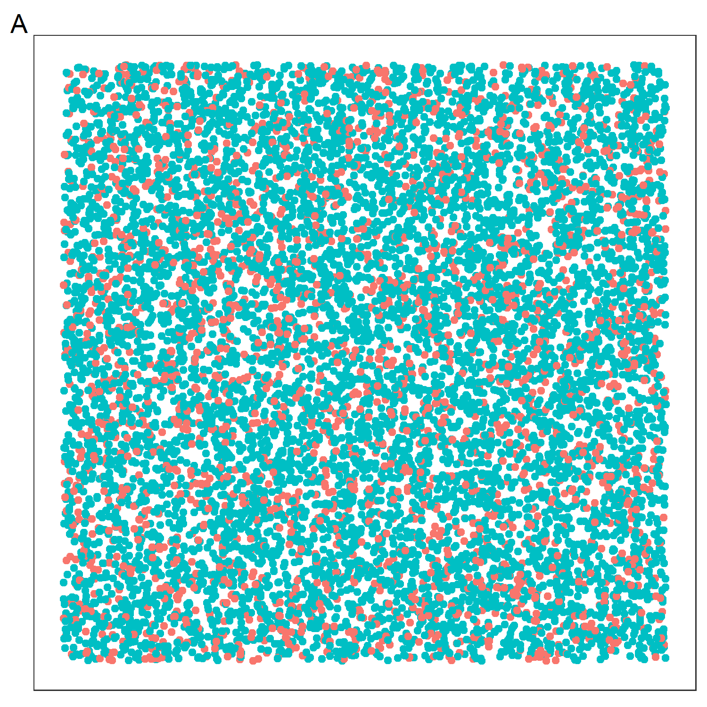{height=22%, width=22%}
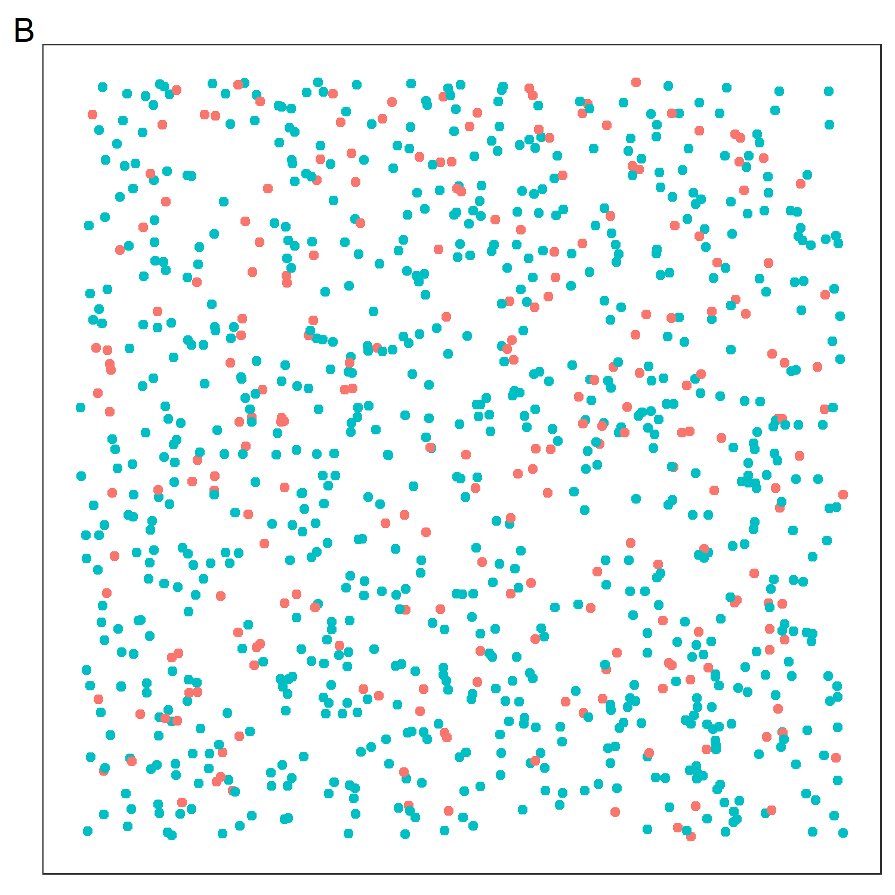{height=22%, width=22%}
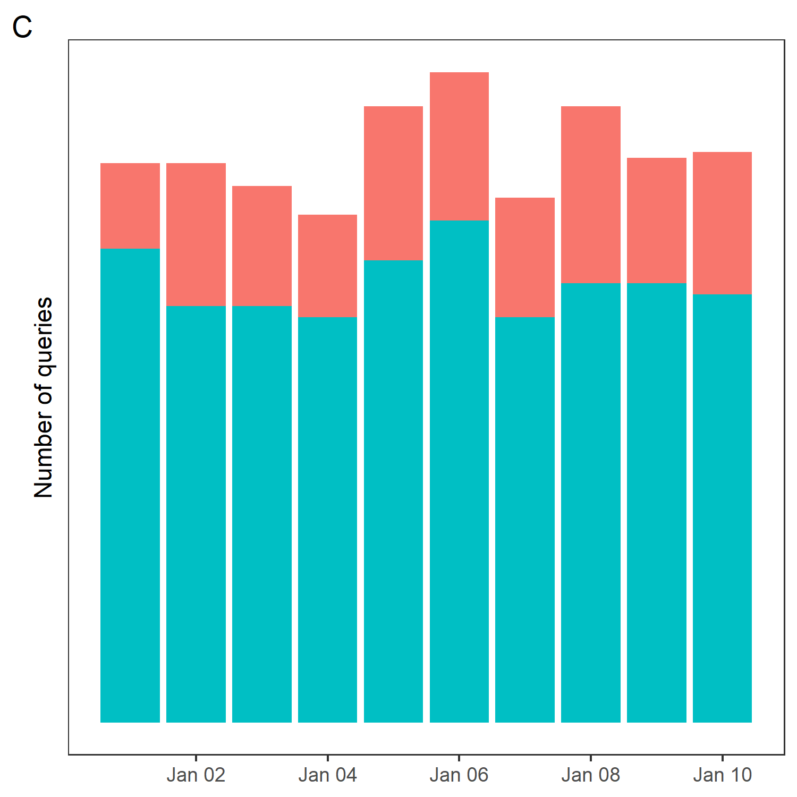{height=22%, width=22%}
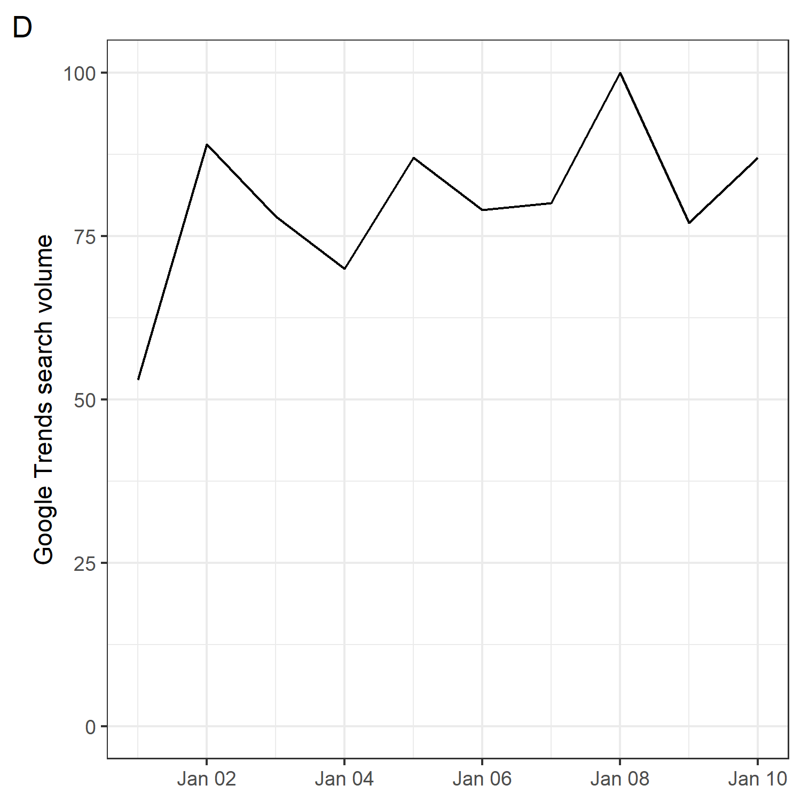{height=22%, width=22%}

Google filters the total population of search queries on its platform to those queries that fit with the user-specified location $l$ and time period $T$. This sample (Panel A) includes all relevant search queries, those that relate to keyword $ko$ (in red) and those do not (in green). To limit computational requirements, Google takes a random sample of the relevant search queries (Panel B) to compute the Google Trends search volume $SV_{ko,l,t}$. Although a substantially lower number of queries is included in the sub-sample, the relation between queries that relate to $ko$ and those that do no, remains the same. Next, Google compares the number of queries that relate to $ko$ for each day $t \in T$ to compute a relative search score (Panel C). To compute the Google Trends search volume $SV_{ko,l,t}$, Google normalizes the relative search score to a value between 0 and 100, where 100 is the maximum search score in the analyzed combination of $ko$, $l$, and $T$.  

# Appendix B

## Relevelling of search volumes
Google Trends does not provide raw search queries for downloads. Instead, Google Trends expresses the number of search queries as search volumes relative to the total number of search queries and then normalizes this data. To use Google Trends data, we first have to bring all search volumes to the same level.  
For object keyword $ko$, included in object batch $bo$, Google Trends observes $SQ_{ko,bo,l,t}$ search queries for location $l$ at time $t$. The number of raw search queries is transformed to search volumes $SV_{ko,bo,l,t}$ by division through the total number of search queries for the given location-time pair $l,t$:

\begin{equation}
SV_{ko,bo,l,t}=\frac{SQ_{ko,bo,l,t}}{\sum SQ_{l,t}}.
\tag{1}
\end{equation}

Next, Google Trends divides search volumes $SV_{ko,bo,l,t}$ by the maximum search value within object batch $bo$ at location $l$ to normalize search volumes to $\tilde{SV}_{ko,bo,l,t}$:

\begin{equation}
\tilde{SV}_{ko,bo,l,t}=\frac{SV_{ko,bo,l,t}}{max(SV_{bo,l})*100}.
\tag{2}
\end{equation}

Since this normalization step is contingent on the maximum search volume within object batch $bo$, normalized search volumes $\tilde{SV}$ depend on the other keywords included in the object batch, the choice of location, and time span $T$ ($t \in T$) for which data is obtained. To prepare normalized search volumes $\tilde{SV}$ for further usage, the `globaltrends` packages follows Castelnuovo and Tran (2017, pp. A1-A2) to relevel $\tilde{SV}$ through mapping to a benchmark. To this end, we map all $\tilde{SV}$ values in object batch $bo$ to the same level as $\tilde{SV}$ values in control batch $bc$. The function `download_object` automatically adds a control keyword $kc$ to all object batches $bo$. In functions `compute_score` and `compute_voi`, $\tilde{SV}_{kc,bc,l,t}$ of control keyword $kc$ in control batch $bc$ is divided by $\tilde{SV}_{ko,bc,l,t}$ in object batch $bo$. By multiplying the result of this division with normalized search volumes $\tilde{SV}_{ko,bo,l,t}$, we get releveled search volumes $\tilde{SV}_{ko,bc,l,t}$ for object keyword $ko$, at location $l$, at time $t$:

\begin{equation}
\tilde{SV}_{ko,bc,l,t}=\tilde{SV}_{ko,bo,t,l}*\frac{\tilde{SV}_{kc,bc,l,t}}{\tilde{SV}_{kc,bo,l,t}}.
\tag{3}
\end{equation}

After the relevelling, search volumes from all object batches use control batch $bc$ as basis for normalization.

## Computing search scores
The outcome of the relevelling is not a de-normalization but that search volumes are releveled to control batch $bc$. This means that $\tilde{SV}_{ko,bc,l,t}$ may still be distorted by $max(SV_{bo,l})$. To overcome such distortion, functions `compute_score` and `compute_voi` divide $\tilde{SV}_{ko,bc,l,t}$ by search volumes for a set of control keywords $KC$. Since *gmail*, *maps*, *translate*, *wikipedia*, and *youtube* allow an approximation of “standard” search volumes on Google, we propose them as control keywords for global trend analysis. These keywords approximate the baseline search traffic on Google. For specific research settings, we suggest adapting control keywords to the respective setting and testing them on the Google Trends portal beforehand. To compute search score $SC_{ko,l,t}$, we divide search volumes for object keywords by the sum of search volumes for control keywords $kc \in KC$:

\begin{equation}
SC_{ko,l,t}=\frac{\tilde{SV}_{ko,bc,l,t}}{\sum_{kc \in KC} \tilde{SV}_{kc,bc,l,t}}.
\tag{4}
\end{equation}

Using equation (3) for normalization from above, we can rewrite the equation (4) for $SC$ as follows:

\begin{equation}
SC_{ko,l,t}=\frac{\tilde{SV}_{ko,bo,t,l}*\frac{\tilde{SV}_{kc,bc,l,t}}{\tilde{SV}_{kc,bo,l,t}}}{\sum_{kc \in KC} \tilde{SV}_{kc,bc,l,t}}
\tag{5}
\end{equation}

\begin{equation}
SC_{ko,l,t}=\frac{\frac{SV_{ko,bo,t,l}}{max(SV_{bo,l})*100}*\frac{\frac{SV_{kc,bc,l,t}}{max(SV_{bc,l})*100}}{\frac{SV_{kc,bo,l,t}}{ max(SV_{bo,l})*100}}}{\sum_{kc \in KC} \frac{SV_{kc,bc,l,t}}{ max(SV_{bc,l})*100}}
\tag{6}
\end{equation}

\begin{equation}
SC_{ko,l,t}=\frac{SV_{ko,bo,t,l}*\frac{SV_{kc,bc,l,t}}{SV_{kc,bo,l,t}}}{\sum_{kc \in KC} SV_{kc,bc,l,t}}
\tag{7}
\end{equation}

\begin{equation}
SC_{ko,l,t}=\frac{SV_{ko,bc,l,t}}{\sum_{kc \in KC} SV_{kc,bc,l,t}}.
\tag{8}
\end{equation}

Using the equation (1) for $SV$ from above, we can reformulate $SC$ as:

\begin{equation}
SC_{ko,l,t}=\frac{\frac{SQ_{ko,l,t}}{\sum SQ_{l,t}}} {\sum_{kc \in KC} \frac{SQ_{kc,l,t}}{\sum SQ_{l,t}}}.
\tag{9}
\end{equation}

\begin{equation}
SC_{ko,l,t}=\frac{SQ_{ko,l,t}}{\sum_{kc \in KC} SQ_{kc,l,t}}.
\tag{10}
\end{equation}

Based on these transformations, we can interpret search score $SC$ as the ratio of search queries $SQ_{ko,l,t}$ for object keyword $ko$ divided by the sum of search queries $SQ_{kc,l,t}$ for control keywords $ko \in KC$ at location $l$ for time $t$. Since $SC$ is independent from any keyword batch $bo$ or $bc$, search scores therefore allow comparison across objects of interest, time, and countries.
