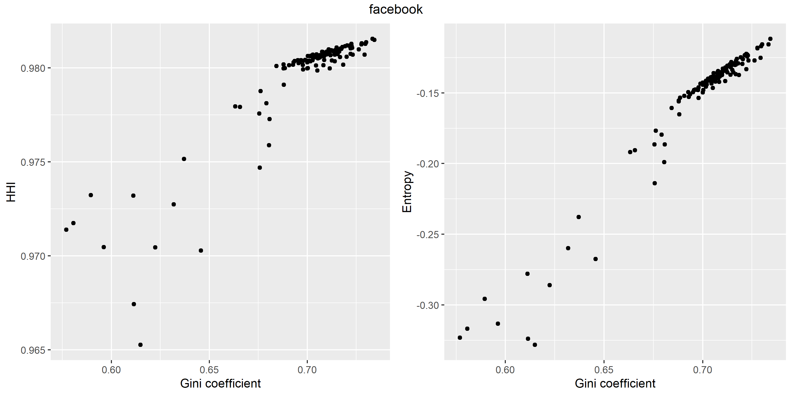
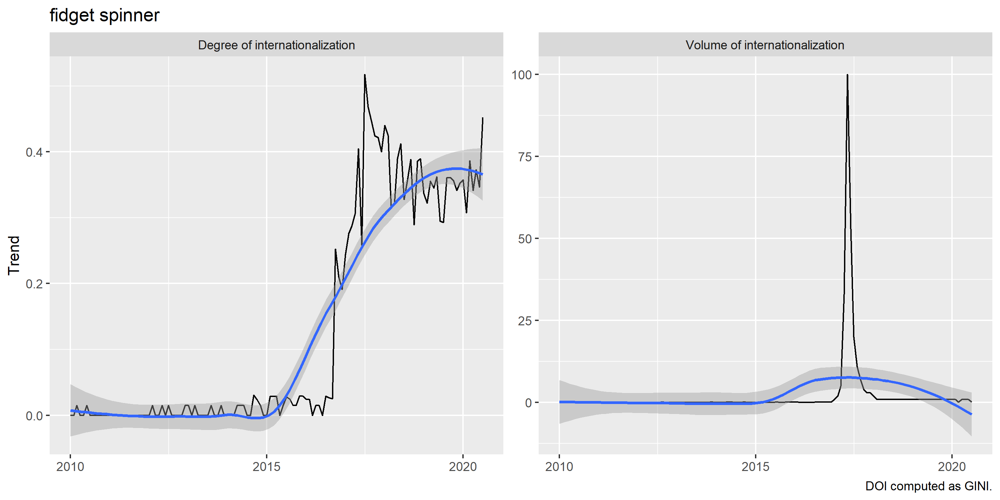

```{r, include = FALSE}
knitr::opts_chunk$set(
  collapse = TRUE,
  comment = "#>"
)
```

```{r setup, eval = FALSE}
library(globaltrends)
```

# Google Trends

Google offers public access to global search volumes through its search engine through the [Google Trends portal](http://www.google.com/trends). Users select up to five keywords for which they want to obtain search trend data and specific the timeframe and location (global, country, state, community) of interest. For these combinations of five keywords, period, and location Google Trends computes a Search Volume Index (SVI) that indicates the number of search queries submitted to the Google search engine. The `globaltrends` package downloads these SVIs provided by Google Trends and uses them to measure and analyze the distribution of search trends across countries or within countries. `globaltrends` allows researchers and analysts to investigate patterns within these trends, such as degree of internationalization of firms and organizations or dissemination of political, social, or technological trends across the globe or within single countries.  

Google Trends normalizes the SVI for any given keyword-period-location combination to a value between 0 and 100, where 100 corresponds to the greatest SVI for the time series. Due to this normalization, users cannot compare SVIs for two keyword-period-location combinations. The `globaltrends` package uses a group of baseline keywords that correspond to “standard” search traffic on Google and computes search scores for each keyword for a given date for a given location. These search scores allow direct interpretability and comparison of Google Trends data across keyword-period-location combinations.

# Analyze internationalization of firms
We demonstrate the functionality of the `globaltrends` package based on a sample of six large U.S. firms. In this brief case study, we analyze the degree of internationalization of *Alaska Air Group Inc.*, *Coca-Cola Company*, *Facebook Inc.*, *Illinois Tool Works Inc.*, *J.M. Smucker Company*, and *Microsoft Corporation*. The workflow consists of four major steps:

1. Setup and start database
2. Download data from Google Trends
3. Compute search score and internationalization
4. Exports and plots

## Setup and start database
Research projects that use Google Trends data to analyze global trends amass a substantial amount of data. To optimally handle this amount of data, the `globaltrends` package uses a [SQLite database]( https://www.sqlite.org/index.html) to store and handle all data. This ensures efficiency and portability on the one hand and seamless integration with the functions implemented in the `DBI` and `dplyr` packages on the other hand.  

Users create the underlying database through the `initialize_db` command. The command creates a folder named *db* within the current working directory and creates a SQLite database file named *globaltrends_db.sqlite* within this folder. The command also creates all necessary tables within the database. To get more information on these tables refer to the built-in documentation, e.g. `?globaltrends::data_score`. The database initialization is necessary only for the first usage of the `globaltrends` package.

```{r, eval = FALSE}
setwd("your/globaltrends/folder")
initialize_db()
#> Database has been created.
#> Table 'batch_keywords' has been created.
#> ...
#> Table 'data_global' has been created.
#> Successfully disconnected.
```

Once the user has initialized the database or to resume work on an existing database it is sufficient to call `start_db` from the respective working directory. This command connects to the *globaltrends.sqlite* database in the folder *db* and creates connections to all tables in the database.

```{r, eval = FALSE}
setwd("your/globaltrends/folder")
start_db()
#> Successfully connected to database.
#> Successfully exported all objects to .GlobalEnv.
print(ls())
#>  [1] "batch_keywords"   "batch_time"       "countries"        "data_control"
#>  [5] "data_doi"         "data_global"      "data_locations"   "data_mapping"
#>  [9] "data_object"      "data_score"       "dir_current"      "dir_wd"
#> [13] "globaltrends_db"  "keyword_synonyms" "keywords_control" "keywords_object"
#> [17] "time_control"     "time_object"      "us_states"
```

After all work with the `globaltrends` package is complete, the user disconnects from the database with the command `disconnect_db`.

```{r, eval = FALSE}
disconnect_db()
#> Successfully disconnected.
```

## Download data from Google Trends
The next step in the `globaltrends` workflow is the data download from Google Trends. The `globaltrends` package includes four types of download functions that we explain in detail below. Each of these functions uses the `gtrendsR::gtrends` function to access the Google Trends API. The Google Trends API allows inputs of up to five keywords for a given location and period. Therefore, the `globaltrends` package works with “keyword batches” that combine up to five keywords. The respective batch numbers are an input to all functions – either as `list` or as single `integer` objects. In the package, we distinguish two types of batches: **control** batches that include baseline keywords and **object** batches that include keywords relating to the objects of interest (e.g. firms, persons, trends…). Currently, `globaltrends` only includes two sets of locations. The *countries* set, which covers all countries that generated at least 0.1% of world GDP in 2018 and the *us_states* set, covering all US states and Washington DC, see [below](#changing-locations) for further details.  

The download for a single keyword batch for a single location takes about 30 seconds. This includes a randomized waiting period of 20-30 seconds between downloads. Depending on the frequency of downloads, Google Trends might block users for some time. In this case, `globaltrends` waits 60 minutes before it retries the download.

### Download control data
First, we add a batch of control keywords to the database using `add_control_keyword`. We suggest *gmail*, *maps*, *translate*, *wikipedia*, and *youtube* as control keywords for global trend analysis. These keywords indicate the baseline search traffic on Google and should be adapted to the respective research setting at hand. The output of `add_control_keyword` is a `list` object that can serve as input for other functions.

```{r, eval = FALSE}
new_control <- add_control_keyword(
  keyword = c("gmail", "maps", "translate", "wikipedia", "youtube"),
  time = "2010-01-01 2019-12-31"
)
#> Successfully created new control batch 1 (gmail ... youtube, 2010-01-01 2019-12-31).
```

The function `add_control_keyword` also updates the `tibble` `keywords_control` in the global environment. This `tibble` can be used for batch lookup.

```{r, eval = FALSE}
dplyr::filter(keywords_control, keyword == "gmail")
#> # A tibble: 1 x 2
#>   batch keyword
#>   <int> <chr>
#> 1     1 gmail
```

As a second step, we download the control data with `download_control`, using the output from `add_control_keyword` as `control` input. The input `locations` defaults to `countries`, see [below](#changing-locations) for further details.    

```{r, eval = FALSE}
download_control(control = new_control, locations = countries)
#> Successfully downloaded control data | control: 1 | location: US [1/66]
#> ...
#> Successfully downloaded control data | control: 1 | location: DO [66/66]
```

A message indicates each successful download and the data is written directly to the database.

### Download object data
Also for object data, the first step is to add the keywords for the analysis. While we use one control batch for the entire analysis, there are more than one object batch (since the analysis covers more than five keywords). Before we add the object keywords, we clean them, deleting punctuation and form of incorporation: *alaska air group*, *coca cola*, *facebook*, *Illinois tool works*, *jm smucker*, and *microsoft*. Since these transformation affects search results, they require substantial consideration and depend on the respective research setting.

```{r, eval = FALSE}
new_object <- add_object_keyword(
  keyword = list(
    c("coca cola", "facebook", "microsoft"),
    c("alaska air group", "illinois tool works", "jm smucker")
  ),
  time = "2010-01-01 2019-12-31"
)
#> Successfully created new object batch 1 (coca cola ... microsoft, 2010-01-01 2019-12-31).
#> Successfully created new object batch 2 (alaska air group ... jm smucker, 2010-01-01 2019-12-31).
```

As for control keywords, the function `add_object_keyword` also updates the `tibble` `keywords_object` in the global environment. This `tibble` can be used for batch lookup.

```{r, eval = FALSE}
dplyr::filter(keywords_object, keyword == "coca cola")
#> # A tibble: 1 x 2
#>   batch keyword
#>   <int> <chr>
#> 1     1 coca cola
```

Again, the second step is to download the object data with `download_object`, using the output from `add_object_keyword` as `object` input. As above, the input `locations` defaults to `countries`.

```{r, eval = FALSE}
download_object(object = new_object, locations = countries)
#> Successfully downloaded object data | object: 1 | location: US [1/66]
#> ...
#> Successfully downloaded object data | object: 2 | location: DO [66/66]
```

A message indicates each successful download. The data is written directly to the database.

### Download mapping data
The control and object data downloaded with the steps outline above, is normalized for each batch. Therefore, we cannot directly compare these data. To compute search scores for the object keywords ([see below](#compute-search-scores)), `globaltrends` downloads a mapping between control and object batches. The `download_mapping` function downloads a two-keyword batch combining one keyword from the control batch and one keyword from the object batch. While the input for *object* can either be an `integer` or a `list`, *control* requires an `integer`. As above, the input `locations` defaults to `countries`.

```{r, eval = FALSE}
download_mapping(control = new_control[[1]], object = new_object, locations = countries)
#> Successfully downloaded mapping data | control: 1 | object: 1 | location: US [1/66]
#> ...
#> Successfully downloaded mapping data | control: 1 | object: 2 | location: DO [66/66]
```

A message indicates each successful download. The data is written directly to the database.

### Download global search data
The `globaltrends` package offers the opportunity to download global search data for object keywords. To avoid within batch normalization, `download_global` runs separately for each keyword within an object batch.

```{r, eval = FALSE}
download_global(object = new_object)
#> Successfully downloaded worldwide data | term: 1/3 [1/2]
#> ...
#> Successfully downloaded worldwide data | term: 3/3 [2/2]
```

A message indicates each successful download. The data is written directly to the database.

## Compute search scores and internationalization
Once the user has completed all control and object downloads, `globaltrends` computes search scores for each keyword-date-location combination. Next, the package uses the across-country distribution of these search scores to measure the degree of internationalization of an object keyword.

### Compute search scores
The function `compute_score` divides the SVI for an object keyword by the sum of SVIs of the keywords in the respective control batch. The search score is interpretable as the ratio of interest in a given keyword compared to the interest in a set of baseline keyword. The search score therefore allows comparison across keywords, dates, and locations.  

The search score computation proceeds in four steps. First, the function aggregates all SVIs as monthly data. Then, it applies some optional time series adjustments that we outline in greater detail [below](#time-series-adjustments). Next, it follows the procedure outlined by Castelnuovo and Tran [-@castel17, pp. A1-A2] to map control and object data. After the mapping, each object search score is divided by the sum of SVIs of the keywords in the respective control batch. We use the sum of SVIs for a set of keywords, rather than the SVI for a single control keyword, to smooth-out variation in the underlying control data. While the input for *object* can either be an `integer` or a `list`, *control* requires an `integer`. As above, the input `locations` defaults to `countries`.

```{r, eval = FALSE}
compute_score(control = new_control[[1]], object = new_object, locations = countries)
#> Successfully computed search score | control: 1 | object: 1 | location: US [1/66]
#> ...
#> Successfully computed search score | control: 1 | object: 2 | location: DO [66/66]
```

Using the same approach, `compute_score_global` computes global search scores for object keywords.

```{r, eval = FALSE}
compute_score_global(control = new_control[[1]], object = new_object)
#> Successfully computed search score | control: 1 | object: 1
#> Successfully computed search score | control: 1 | object: 2
```

A message indicates each successful computation. The data is written directly to the database.

### Compute degree of internationalization
The `globaltrends` package uses the distribution of search scores across countries to compute the degree of internationalization for object keywords. Following international business literature [@fisch12], `compute_doi` uses an inverted Gini-coefficient as measure for the degree of internationalization. The more uniform the distribution of search scores across all countries, the higher the inverted Gini-coefficient and the greater the degree of internationalization. In addition to the Gini-coefficient, the package uses inverted Herfindahl–Hirschman index [@buhner87] and inverted entropy [@hitt97] as measures for internationalization ([details below](#alternative-dispersion-measures)). While the input for *object* can either be an `integer` or a `list`, *control* requires an `integer`. The input `locations` requires the name of a location set as `character` and defaults to `”countries”`.

```{r, eval = FALSE}
compute_doi(control = new_control[[1]], object = new_object, locations = "countries")
#> Successfully computed DOI | control: 1 | object: 1 [1/2]
#> Successfully computed DOI | control: 1 | object: 2 [2/2]
```

A message indicates each successful computation. The data is written directly to the database.

## Exports and plots
`globaltrends` writes all data directly to the database. With the help of functions from the `dplyr` package and connections exported from `start_db`, users can access database tables.

```{r, eval = FALSE}
library(dplyr)
data_score %>%
  filter(keyword == "coca cola") %>%
  collect()

#> # A tibble: 7,128 x 8
#>    location keyword    date score_obs score_sad score_trd batch_c batch_o
#>    <chr>    <chr>     <int>     <dbl>     <dbl>     <dbl>   <int>   <int>
#>  1 US       coca cola 14610   0.00362   0.00381   0.00548       1      1
#>  ...
#> 10 US       coca cola 14883   0.00347   0.00365   0.00389       1      1
#> # ... with 7,118 more rows
```

To enhance usability, the `globaltrends` package includes a set of export functions that offer some filters and return data as `tibble`. Currently the functions do not include `list` inputs – users are advised to `purrr::map_dfr` instead.

```{r, eval = FALSE}
export_control(control = 1)

#> # A tibble: 35,640 x 5
#>    location keyword date        hits control
#>    <chr>    <chr>   <date>     <dbl>   <int>
#>  1 US       gmail   2010-01-01    22       1
#>  ...
#> 10 US       gmail   2010-10-01    27       1
#> # ... with 35,630 more rows

export_score(object = 1, control = 1)

#> # A tibble: 21,384 x 8
#>    location keyword   date       score_obs score_sad score_trd control object
#>    <chr>    <chr>     <date>         <dbl>     <dbl>     <dbl>   <int>  <int>
#>  1 US       coca cola 2010-01-01   0.00362   0.00381   0.00548       1     1
#>  ...
#> 10 US       coca cola 2010-10-01   0.00347   0.00365   0.00389       1     1
#> # ... with 21,374 more rows

purrr::map_dfr(c("coca cola", "microsoft"), export_doi, control = 1, type = "obs")

#> # A tibble: 216 x 9
#>    keyword   date       type       gini   hhi entropy control object locations
#>    <chr>     <date>     <chr>     <dbl> <dbl>   <dbl>   <int>  <int> <chr>    
#>  1 coca cola 2010-01-01 score_obs 0.397 0.874  -0.938       1     1 countries
#>  ...
#> 10 coca cola 2010-10-01 score_obs 0.574 0.968  -0.303       1     1 countries
#> # ... with 206 more rows
```

The export functions from `globaltrends` also allow direct interaction with `dplyr` or other packages for further analysis.

```{r, eval = FALSE}
library(dplyr)

export_doi(object = 1, control = 1, type = "obs") %>%
  filter(lubridate::year(date) == 2019) %>%
  group_by(keyword) %>%
  summarise(gini = mean(gini), .groups = "drop")

#> # A tibble: 3 x 2
#>   keyword    gini
#>   <chr>     <dbl>
#> 1 coca cola 0.615
#> 2 facebook  0.707
#> 3 microsoft 0.682
```

Exports from `globaltrends` also serve as input for the four plot functions implemented in the package. `plot_score` uses the output from `export_score` as input and shows the locations with the highest search scores. The function uses only the first keyword in the dataset and averages the search scores for the input dataset – we therefore suggest filtering the output from `export_score` to a specific period. The plot shows that Coca-Cola has high search scores across Latin America and India.

```{r, eval = FALSE}
library(dplyr)

export_score(keyword = "coca cola", control = 1) %>%
  filter(lubridate::year(date) == 2019) %>%
  plot_score()
```

{width=100%}

The functions `plot_ts` and `plot_box` use output from `export_doi`. `plot_ts` shows how the degree of internationalization for a set of keywords develops over time. `plot_box` generates boxplots of the degree of internationalization distribution. The two plots below compare the degree of internationalization for the six companies in our sample. At first glance, we see that Coca-Cola, Facebook, and Microsoft have a higher degree of internationalization than Alaska Air Group, Illinois Tool Works, and J.M. Smucker. It seems as if the degree of internationalization of Facebook and Microsoft increased slightly from 2010 to 2015. Although the overall trend remains stable, Coca-Cola shows greater within-time series variation than the other companies.

```{r, eval = FALSE}
data <- purrr::map_dfr(1:2, export_doi, keyword = NULL, control = 1, type = "obs")
plot_ts(data_doi = data, grid = TRUE, smooth = TRUE)

plot_box(data_doi = data)
```

{width=100%}

{width=100%}

With the function `plot_trend`, users can compare the degree of internationalization for a keyword to its volume of internationalization. Like `plot_score`, the function uses only the first keyword in a dataset, filtering might be necessary. In the plot below, we compare Facebook’s degree of internationalization to its volume of internationalization. While degree of internationalization relates to the global distribution of search scores, volume of internationalization indicates the level of global search scores. We see that Facebook’s degree of internationalization grew from 2010 before peaking in 2013. At the same time, we observe a constant decrease in volume of internationalization after its peak in 2013.

```{r, eval = FALSE}
out_doi <- export_doi(keyword = "facebook", object = 1, type = "obs")
out_global <- export_global(keyword = "facebook", type = "obs")
plot_trend(data_doi = out_doi, data_global = out_global)
```

{width=100%}

## Additional options
The `globaltrends` package offers several options that allow robustness checks and adjustments to the computations. Users can compute global trend dispersion based on different types of time series, use other measures than the inverted Gini-coefficient, change the type of locations.

### Time series adjustments
The computation of search scores in the `globaltrends` package basically compares a time series of SVIs for an object keyword to the time series of base line SVIs. Noise and seasonality in these time series could affect the resulting search scores. The `globaltrends` package offers two time series adjustments as robustness checks. In the `data_score`table, column `score_obs` refers to values without adjustment. Column `score_trd` uses the underlying time series’ trend for computation.

```{r, eval = FALSE}
search_score <- ts(data$hits, frequency = 12)
fit <- stl(search_score, s.window = "period")
trend <- fit$time.series[, "trend"]
```

Column `score_sad` corrects the time series for seasonal patterns. In general, outcomes for all three types of time series are similar. `score_trd` applies the greatest smoothing, while `score_sad` reduces some noise.

```{r, eval = FALSE}
search_score <- ts(data$hits, frequency = 12)
fit <- stl(search_score, s.window = "period")
seasad <- forecast::seasadj(fit)
```

{width=100%}

The `export_doi`, `plot_ts`, `plot_box`, and `plot_trend` functions allow filtering for the type of time series through the `type` input.

```{r, eval = FALSE}
export_doi(keyword, type = "obs")
plot_ts(data_doi, type = "sad")
plot_box(data_doi, type = "trd")
plot_trend(data_doi, data_global, type = "obs")
```

### Alternative dispersion measures
The `globaltrends` package computes degree of internationalization based on the uniformity of search score distributions across countries. By default, the package uses an inverted Gini-coefficient. As alternatives, the package uses inverted [Herfindahl–Hirschman index](https://en.wikipedia.org/wiki/Herfindahl%E2%80%93Hirschman_Index) and inverted [entropy](https://en.wikipedia.org/wiki/Entropy_(information_theory)) as robustness checks. In general, all the three dispersion measures come to similar results.

{width=100%}

The `export_doi`, `plot_ts`, `plot_box`, and `plot_trend` functions allow filtering for the type of dispersion measures through the `measure` input.

```{r, eval = FALSE}
export_doi(keyword, measure = "gini")
plot_ts(data_doi, measure = "hhi")
plot_box(data_doi, measure = "entropy")
plot_trend(data_doi, data_global, measure = "gini")
```

### Changing locations
By default, `globaltrends` makes all downloads and computations for the *countries* set of locations. The *countries* set covers all countries that generated at least 0.1% of world GDP in 2018. By changing the input *locations* to *us_states*, the package uses US states and Washington DC as basis for downloads and computations instead. Apart from `compute_doi`, all functions use either *countries* or *us_states* as inputs for *locations*. `start_db` exports these vectors of ISO2 codes to the global environment. `compute_doi`, however does not directly refer to these objects, but to their names: `locations = “countries”` or `locations = “us_states”`. We will implement the functionality to add additional sets of locations (e.g. all EU countries, regions within France) soon.

```{r, eval = FALSE}
download_control(control = 1, locations = us_states)
download_object(object = list(1,2), locations = us_states)
download_mapping(control = 1, object = 2, locations = us_states)
compute_score(control = 1, object = 2, locations = us_states)
compute_doi(control = 1, object = list(1,2), locations = "us_states")
```

# Further applications
To measure degree of internationalization, `globaltrends` offers a wide array of empirical possibilities. It allows researchers to compare degree of internationalization for various organizations on a unified scale (e.g. *Coca-Cola Company*, *Facebook Inc.*, *Real Madrid*, and *Manchester United*). In addition, the time-series nature of Google Trends allows for historical analysis of internationalization patterns and speed within organizations.

{width=100%}

The enormous detail of the data opens additional applications in research that are impossible with traditional measures of internationalization. For instance, using `globaltrends` on a subnational level (e.g. `locations = us_states`) allows researchers to study proliferation within a country and, for example, to trace a particular market entry. In addition, `globaltrends` offers applications beyond corporate internationalization, such as data on global interest in products, persons, events, fads or scandals, even academic authors and papers. A product-level analysis of the internationalization of a hyped kids gadget, the fidget spinner, for example, shows its rapid internationalization from Brooklyn to the most sold toy worldwide.

{width=100%}

# References
